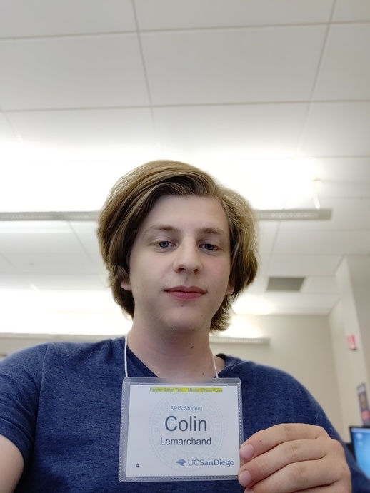

# practice-colin-l
I moved here from Wake Forest, North Carolina (although originally I'm from Seattle). I'm looking forward to learning Python and seeing how different it is from Java and C! I'm near fluent in French and am a French citizen, I've played the flute for 6 years and plan to minor in Music in addition to my Computer Science major, and I love driving!

